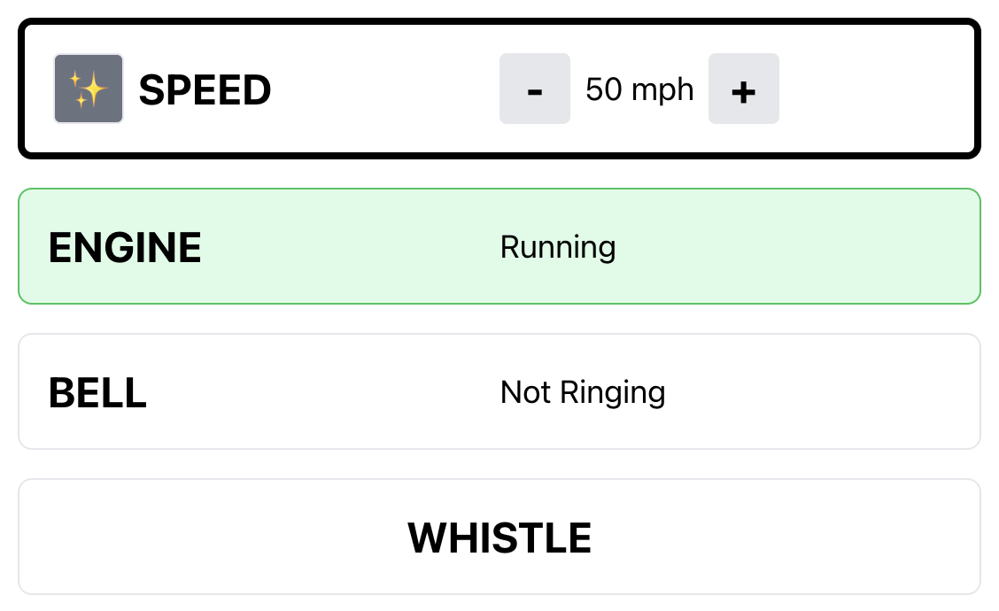

# Big Boy

This is a somewhat silly project that I build for my little boys who are obsessed
with trains and specifically steam engine locomotives. They run around the house
making steam engine noises, calling themselves steam engines. I take them to
preschool in the mornings and they've taken to calling my car the "Big Black Engine",
which is their name for a specific steam engine: the ["Living Legend" Union Pacific
844](https://www.up.com/heritage/steam/844/index.htm). They also really enjoy the "Big Boy" which is an official nickname for the
[Union Pacific 4014](https://www.up.com/heritage/steam/4014/index.htm).

One morning while driving them to school the idea struck me: _what if my car really
was the Big Black Engine?_ Since I always have my iPhone plugged into my car with
CarPlay anyway, I could play any kind of sounds through the car speakers that I
wanted to: specifically steam engine noises, whistles, and bells. I had the thought
almost immediately that I could probably use the [Geolocation Web API](https://developer.mozilla.org/en-US/docs/Web/API/Geolocation_API) to get my live
location and possibly even my speed, which could be used to automatically adjust the
sounds of the steam engine, making the sounds from my "steam engine" model what was
actually happening in my car.

This project is my attempt at making a reasonably high-quality attempt at this idea
in an attempt to experiment with new APIs I've not used before
(`navigator.geoLocation`), UI composition with [finite state machines](https://xstate.js.org/), [WebAudio API](https://developer.mozilla.org/en-US/docs/Web/API/Web_Audio_API),
audio editing, etc.

**But mostly my stakeholders are my two train-loving twin boys who now make me drive
them to school every weekday morning with bells and whistles blaring the whole way. 😅**

## Available Scripts

In the project directory, you can run:

### `yarn start`

Runs the app in the development mode.\
Open [http://localhost:3000](http://localhost:3000) to view it in the browser.

The page will reload if you make edits.\
You will also see any lint errors in the console.

### `yarn test`

Launches the test runner in the interactive watch mode.\
See the section about [running tests](https://facebook.github.io/create-react-app/docs/running-tests) for more information.

### `yarn build`

Builds the app for production to the `build` folder.\
It correctly bundles React in production mode and optimizes the build for the best performance.

The build is minified and the filenames include the hashes.\
Your app is ready to be deployed!

See the section about
[deployment](https://facebook.github.io/create-react-app/docs/deployment) for more
information.
